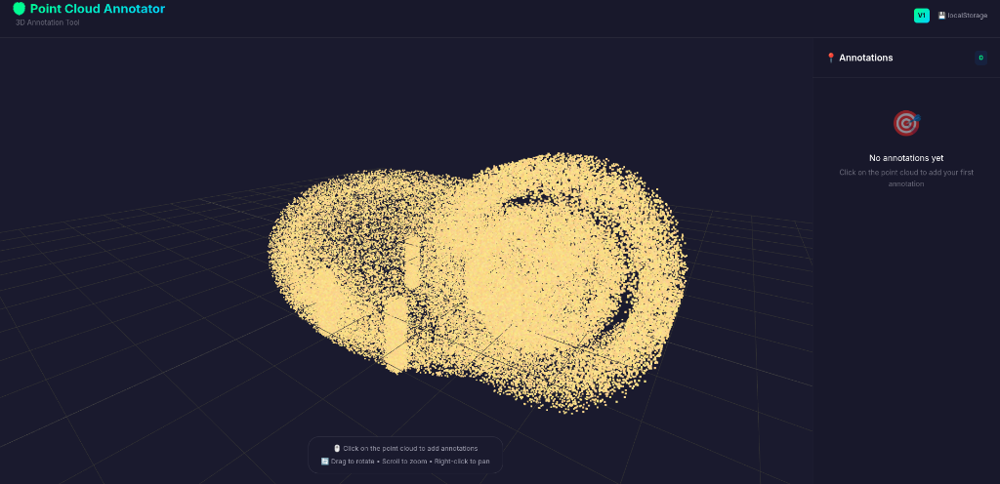

# 🦁 Point Cloud Annotator

A web-based 3D point cloud annotation tool built with React, TypeScript, and Three.js.


## ✨ Features

- **3D Point Cloud Visualization**: Interactive 3D viewer with orbit controls
- **Annotation System**: Click on any point to create annotations
- **Text Annotations**: Attach text notes (max 256 bytes) to any point
- **Cloud Persistence**: Full serverless backend using **AWS DynamoDB**
- **Modern UI**: Sleek dark theme with glassmorphism effects

## 📸 Screenshot



## 🛠️ Tech Stack (V3 Architecture)

| Category | Technology |
|----------|------------|
| **Frontend** | React 19 + TypeScript + Vite |
| **Hosting** | **AWS S3** (Static Website Hosting) |
| **Api** | **AWS API Gateway** (HTTP API) |
| **Compute** | **AWS Lambda** (Node.js 20.x, TypeScript) |
| **Database** | **AWS DynamoDB** (On-demand) |
| **IaC** | **Terraform** |
| **Bundling** | **esbuild** (Zero-dependency deployment) |

## 🚀 Quick Start (Development)

### Prerequisites

- Node.js 20.x or higher
- npm 10.x or higher

### Installation

```bash
# Clone the repository
git clone <repository-url>
cd point-cloud-annotator

# Install dependencies
npm install

# Start development server
npm run dev
```

The application will be available at `http://localhost:5173`.
By default, it may default to localStorage unless you configure `.env` to point to the live API.

## ☁️ Deployment (AWS)

This project uses **Terraform** to provision a complete Serverless stack (Tier 3 Requirements).

### 1. Prerequisites
- [Terraform](https://www.terraform.io/) installed.
- AWS Account and Credentials configured.

### 2. Build Backend
We compile the TypeScript Lambda handler to a single JavaScript bundle to keep the artifact small.

```bash
npm run build:lambda
```

### 3. Deploy Infrastructure
Provision API Gateway, Lambda, DynamoDB, and S3.

```bash
cd terraform
terraform init
terraform apply
```
*Note the `api_gateway_url` and `website_url` from the outputs.*

### 4. Build & Deploy Frontend
Update your `.env` with the URL from the previous step:
```env
VITE_STORAGE_PROVIDER='api'
VITE_API_URL='<your-api-gateway-url>'
```

Build and sync to S3:
```bash
# Build React App
npm run build

# Upload to S3 (using AWS CLI)
aws s3 sync dist/ s3://<your-bucket-name>
```

## 📁 Project Structure

```
point-cloud-annotator/
├── src/                 # Frontend React App
├── aws/
│   ├── handlers/        # Lambda Function Source (TypeScript)
│   └── dist/            # Compiled Lambda Artifacts (gitignored)
├── terraform/           # Infrastructure as Code
│   ├── main.tf
│   ├── variables.tf
│   └── outputs.tf
├── package.json         # Root scripts for both Frontend & Backend
└── vite.config.ts
```

## 🗺️ Roadmap Compatibility

- **V1 (Local)**: Fully supported (just switch `VITE_STORAGE_PROVIDER` to `local`).
- **V2 (Netlify)**: Logic abstracted in `storage.ts`, easy to swap back if needed.
- **V3 (AWS)**: **Current Production Standard**.

## 📝 Acceptance Criteria (Tier 3)

- [x] Frontend hosted as static website on **AWS S3 bucket**.
- [x] Serverless backend using **AWS Services**.
- [x] **API Gateway** triggers **Lambda**.
- [x] Lambda reads/writes to **NoSQL database (DynamoDB)**.
- [x] Infrastructure as Code (**Terraform**) provided.

## 📄 License

MIT License.

---

Built with ❤️ for Unleash Live Skills Assessment
